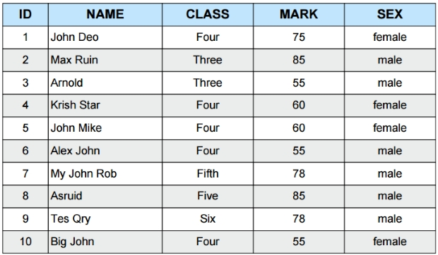
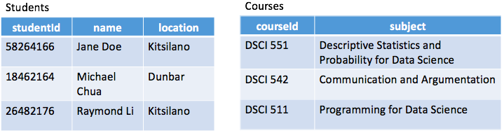
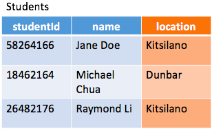
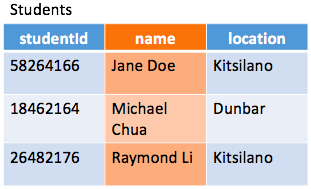
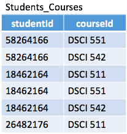
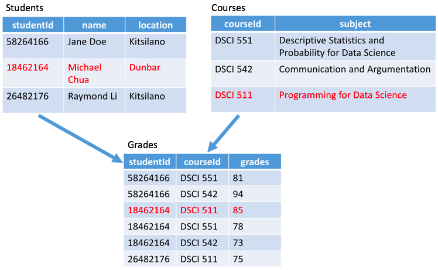

___
## Relational Databases for Dummies

Author: Patrick Tung

Date: September 11, 2018
___
Reading the subject of the blog, you might be wondering: "What is this *relational database* that you are talking about?" My goal today is to use this article to answer this question.

As we all progress through the MDS program together, we will be learning about how to use data, perform calculations using models, and present results. Now, imagine that we are working at ABC Corp. and we need to perform a trend analysis for the sales transactions of our company. But where will we get this data from? As aspiring data scientists, we will be working with a lot of relational databases where most of the data resides. I hope it is evident now that relational databases are important sources for data scientists.

### Key Concepts
Before we go on and explore what a relational database is, we should first explain what a database is. Looking at the word "database", we can probably infer that a database is a place where you can store data, and that's not wrong. In fact, in a **relational database**, these stored data have logical links between each other.

Let's start with the following table:

As you may have expected, what we have here is just called a **table**, and it represents a set of data about a thing or event. A table can have one or many columns, which are called **fields** and represent an attribute of the thing or event. For our table, the fields are:

A table can also have hundreds and thousands of rows, which are called **records**. A record is a group of logically related fields. Some examples of records are:

Each one of these is a record. You can see here that Max Ruin attends class Three, in which he has a mark of 75.

### What are Relationships?
Now that we have a basic understanding of some key words used in relational databases, we can move on to the exciting part of this blog.

Let's start off and imagine that UBC has a database that has information about their students and information about their classes. It would look something like this.

The ultimate goal for UBC is to create a relationship between these two tables, `Students` and `Courses`, so that they can store information about the grades of their students.

### Keys
Let's first take a look at the `Students` table. Try and think about how we can identify one unique record, or in this case, one specific student.

* **Can we use the `location` field? No.** Because there are multiple students that are located in the same area.

* **Can we use the `name` field? No.** Because there can be multiple students with the same name as well. Maybe unlikely, but definitely possible.

The field that helps us pinpoint a specific record is the `studentId` field because this field is unique. This field is called the **key** field and because it is the column that identifies the unique row in a table, it is also known as the **Primary Key**. The same idea goes for the course information table, where `courseId` is the primary key of `Courses` table.

Now, what if we want to store information about the students in their specific courses? What we need to do here is to relate the two tables. For simplicity, we will only be using the primary keys of each table to visualize this relationship. One way we can create a relationship between the tables is to establish a middle table that looks something like the image below. The reason for this will be explained later.

We have just created a `Students_Courses` table. Before we move on, one thing I'd like to add about primary keys is that it can include more than one field. At the moment, this junction table has a primary key that is the combination of both `studentId` and `courseId`. At the same time, they are also **foreign keys**. A foreign key for a table is simply a key that is a unique identifier for another table.

### Types of Relationships
Relationships are what makes relational databases *relational*. **Relationships** in databases are really similar to those in real life. You should be able to think of many relationships, perhaps with your family, friends, or even your manager. You and your mother are related in a way such that you only have one mother, but she may have many children. There are three types of relationships:
* One-to-One: e.g. Country-Flag (One country can only have one flag, and each flag can only represent a single country.)

* One-to-Many: e.g. Person-Cars (A person can own multiple cars, but a car can only belong to one person.)

* Many-to-Many:

At this point, you should be able to guess that the example we have walked through today depicts a **many-to-many** relationship between `Students` and `Courses`. Each student can take many courses, and each course is taken by many students. However, there is one peculiar feature about this relationship that the other two do not have. Unlike the other two, if you wanted to store any information about a many-to-many relationship, then you must create a junction table known as the **associative table**.

The associative table provides the ability to store information that the other two tables cannot on their own. In our case, `grades`. Looking at the tables, the you can easily see that the student with an id of *18462164* achieved a score of *85* in *Programming for Data Science*. Together, we have created a database for UBC to record the grades of their students, and we have learned the basics of reading relational databases.

There is still much more to learn, but for now, thanks for reading my blog.
